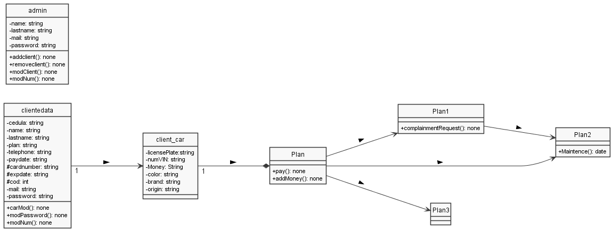

# Rowy
Darwin Charris y Tomás Cervera.
El programa presenta como solución hacer el pago de los impuestos de tu carro desde la comodidad de tu casa, para ello se cuentan con tres planes con diferentes funcionalidades.
## Para probar el apartado de administradores:
Correo: anaa@rowy.com
Contraseña: 123ana
## Para probar el apartado de clientes
Correo: jd@gmail.com
Contraseña: 12345
CVV: 032
# Diagrama UML de clases

# Guia de usuarip
